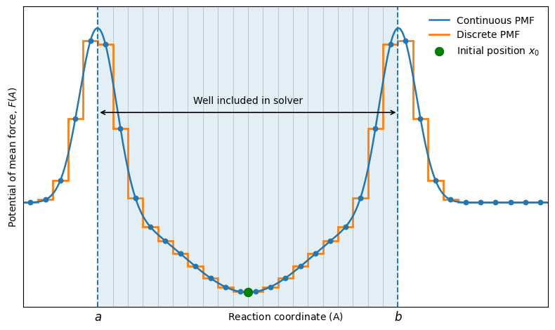

### Kinetic reweighting
Kinetic parameters of protein binding and dissociation can be estimated from the PPI-GaMD simulations by combining residence-time analysis, energetic reweighting of the PMF, and Kramers’ rate theory. Kramers’ rate theory describes barrier crossing on a free-energy surface. For biomolecular systems in aqueous solvent, the motion occurs in the high-friction regime, and the overdamped form of Kramers’ expression can be used:
$$
k_R = \frac{w_mw_b}{2\pi\xi}
\exp\left(-\frac{\Delta F}{k_B T}\right)
$$

where $\xi=kBT/D$ with $D$ being the apparent  diffusion constant, $w_m$ and $w_b$ is the frequency of oscillation at the relevant energy minimum and barrier, respectively, and $\Delta F$ is the free-energy barrier for the transition [4]. 

First, the apparent transition rates are obtained directly from the biased simulation trajectories by calculating the average residence time in the bound and unbound states:

$$
\begin{split}
k_{\text{off}}^* &= \frac{1}{\tau_B} \\
k_{\text{on}}^* &= \frac{1}{\tau_U[L]}
\end{split}
$$
where [L] is the ligand protein concentration in the simulation box. 

To correct the biased kinetic parameters, the reweighted PMF is used together with Kramers’ rate theory. The PMF for a standard protein association/dissociation is shown schematically here below:

The free-energy barriers for dissociation and association are obtained from the PMF as:
$$
\begin{split}
\Delta F_{\text{off}} &= F(A_{BR}) - F(A_B) \\
\Delta F_{\text{on}} &= F(A_{BR}) - F(A_U)
\end{split}
$$

where $A_B$ is the position of the bound-state minimum, $A_U$ is the position of the unbound-state minimum, and $A_{BR}$ is the position of the barrier separating the two states along the chosen reaction coordinate.

The PMF curvatures are obtained by locally fitting the PMF to a 2nd dgree polynomial around the minima and the barrier. 
$$
\begin{split}
F(A) &\approx c_1\cdot A^2+c_2\cdot A+c_3 \\
F''(A) &\approx c_1
\end{split}
$$

This approach is less sensitive to numerical noise than calculating the second derivative directly from the binned PMF. Finally, the frequency of oscillation is found by:
$$
    w_{A} = \sqrt{\frac{|F''(A)|}{2\pi}} 
$$

The apparent diffusion coefficient (D) is estimated by solving the one-dimensional Smoluchowski equation along the PMF. The purpose of the Smoluchowski solver is to estimate a model escape rate from a one-dimensional free-energy profile. In this work, the free-energy profile is obtained as a potential of mean force (PMF) along a chosen reaction coordinate, for example, an interface distance or RMSD. The central assumption is that motion along this coordinate can be approximated as overdamped diffusion on the PMF. Given a probability initially placed within a free-energy well, the solver then estimates how long it will take for a probability to escape over a chosen barrier. The Smoluchowski equation can be written as:

$$
\frac{\partial \rho(A,t)}{\partial t}
=
D
\frac{\partial}{\partial A}
\left[
e^{-\beta F(A)}
\frac{\partial}{\partial A}
\left(
e^{\beta F(A)}\rho(A,t)
\right)
\right]
$$

where $\rho(A,t)$ is the probability density along the reaction coordinate. The probability distribution is initialized in the relevant energy well according to the Boltzmann distribution:

$$
\rho(A,0) \propto e^{-\beta [F(A)-F(A_m)]}
$$

The survival probability is then calculated as the fraction of probability remaining inside the starting well:

$$
S(t) =
\frac{
\int_{\text{well}} \rho(A,t)dA
}{
\int_{\text{well}} \rho(A,0)dA
}
$$

For a single dominant transition process, the survival probability follows an approximately exponential decay:

$$
S(t) = e^{-kt}
$$

and therefore:

$$
\ln S(t) = -kt
$$

The slope of $\ln S(t)$ as a function of Smoluchowski time gives the model transition rate.

In practise to solve the Smoluchowski equation the PMF is first converted into a dimensionless free energy,

$$
U(x)=\beta F(x)=\frac{F(x)}{k_BT},
$$

where $k_B$ is Boltzmann's constant, $T$ is the temperature, and $\beta=1/k_BT$.

The solver builds on the behaviour of one-dimensional overdamped diffusion. Firstly, simple flux down a concentration gradient is considered based on Fick's first law:

$$
J(x,t)
=
-D\frac{\partial C(x,t)}{\partial x}
$$

where $J$ is the flux, $D$ is the diffusion coefficient, and $C(x,t)$ is the concentration along the reaction coordinate $x$. 

In the present case, diffusion occurs on a free-energy landscape rather than in a flat potential, which introduces a drift term caused by the thermodynamic force. The total flux is therefore written as
$$
J(x,t)
=
-D\left[\frac{\partial C(x,t)}{\partial x}
+
\frac{\partial U(x)}{\partial x}C\right]
$$

Rewriting the flux in terms of the probability of finding a particle at $x,t$:

$$
    p(x,t)=\frac{C(x,t)}{\int_0^LC(x,t)dx}
$$

Leads to Smolukowski's equation, which describes the time evolution of a probability density $p(x,t)$ undergoing diffusion on a free-energy surface:

$$
\frac{\partial p(x,t)}{\partial t}
=
D\frac{\partial}{\partial x}
\left[
\frac{\partial p(x,t)}{\partial x}
+
\beta p(x,t)\frac{\partial F(x)}{\partial x}
\right],
$$

where the first term inside the brackets accounts for ordinary diffusion from regions of high probability to regions of low probability. The second term accounts for drift caused by the slope of the PMF. In other words, probability is allowed to diffuse randomly, but its motion is biased by the free-energy landscape.

To find a useful form for the initial distribution of this equation, the equilibrium state is considered as a starting condition. At equilibrium, there should be no net probability flux, setting $\frac{\partial p(x,t)}{\partial t}=0$:
$$
\frac{\partial p_\mathrm{eq}(x)}{\partial x}
=
-\beta p_\mathrm{eq}(x)\frac{\partial F(x)}{\partial x}.
$$

Dividing by $p_\mathrm{eq}(x)$ and integrating gives

$$
p_\mathrm{eq}(x)
=
A e^{-\beta F(x)},
$$

where $A$ is a normalization constant. As such, for the diffusion process considered, Smoluchowski's equation can also be written as

$$
\frac{\partial p(x,t)}{\partial t}
=
D\frac{\partial}{\partial x}
\left[
e^{-\beta F(x)}
\frac{\partial}{\partial x}
\left(
e^{\beta F(x)}p(x,t)
\right)
\right].
$$

Due to the lack of an analytical description of the PMF, Smoluchowski's is also solved numerically. In the solver, the continuous PMF is represented by discrete bins. The coordinate is divided into points $x_i$ separated by a spacing $\Delta x$. Instead of following a continuous probability density, the solver follows the probability $p_i(t)$ associated with each bin $i$. The selected well is defined by two indices, $a$ and $b$, corresponding to the left boundary and the barrier-side boundary of the interval.

The initial probability distribution is assumed to be locally equilibrated inside this selected interval. Therefore, the initial probability in each bin is assigned according to the Boltzmann distribution restricted to the well:

$$
p_i(0)
=
\frac{
e^{-(u_i-u_\mathrm{min})}
}{
\sum_{j=a}^{b} e^{-(u_j-u_\mathrm{min})}
},
\qquad i=a,\ldots,b.
$$

Here $u_\mathrm{min}$ is the minimum value of $u_i$ inside the selected interval.

Once the initial distribution has been assigned, the solver propagates probability between neighbouring bins. This converts the Smoluchowski equation into a nearest-neighbour master equation:

$$
\frac{dp_i}{dt}
=
k_{i-1\rightarrow i}p_{i-1}
+
k_{i+1\rightarrow i}p_{i+1}
-
\left(
k_{i\rightarrow i-1}
+
k_{i\rightarrow i+1}
\right)p_i.
$$
with $k_{i\rightarrow i+1}$ denoting the transistion rate from bin $i$ to bin $i+1$.

This equation simply states that the probability in bin $i$ changes due to probability entering from neighbouring bins and probability leaving to neighbouring bins.

The transition rates are chosen so that they favour downhill motion on the PMF while still allowing thermally activated uphill motion. For neighbouring bins $i$ and $j$, the rate is

$$
k_{i\rightarrow j}
=
\frac{D}{\Delta x^2}
\exp\left[
-\frac{u_j-u_i}{2}
\right],
\qquad j=i\pm1.
$$

This expression has two important properties. First, if $u_j<u_i$, the transition is downhill and the exponential factor becomes larger than one. If $u_j>u_i$, the transition is uphill and the exponential factor becomes smaller than one. Second, the rates satisfy local detailed balance:

$$
\frac{k_{i\rightarrow j}}{k_{j\rightarrow i}}
=
e^{-(u_j-u_i)}
=
\frac{p_j^\mathrm{eq}}{p_i^\mathrm{eq}}.
$$

This ensures that the discretized dynamics is consistent with the Boltzmann distribution on the PMF.

The master equation is propagated using an explicit Euler scheme. For each time step, the probability in bin $i$ is updated according to

$$
p_i(t+\Delta t)
=
p_i(t)
+
\Delta t\frac{dp_i}{dt}.
$$

In practical terms, this means that the solver calculates the incoming and outgoing probability flow for each bin, then updates the distribution by a small time increment $\Delta t$. Euler propagation is simple and transparent, but it is only stable when the time step is sufficiently small. The solver, therefore, estimates a stable time step from the fastest outgoing rate from any bin:

$$
\Delta t_\mathrm{stable}
=
s\frac{\Delta x^2}{D\max_i r_i^\mathrm{out}},
$$

where $s$ is a safety factor, typically set to 5\% and

$$
r_i^\mathrm{out}
=
\exp\left[-\frac{u_{i-1}-u_i}{2}\right]
+
\exp\left[-\frac{u_{i+1}-u_i}{2}\right],
$$

The behaviour at the edges of the selected interval is controlled by boundary conditions set based on the specific system considered. A reflective boundary prevents probability from leaving through that side:

$$
k_{a\rightarrow a-1}=0
\quad \text{or} \quad
k_{b\rightarrow b+1}=0.
$$

This is applied when one side of the interval corresponds to an unphysical or irrelevant region of the reaction coordinate. For example, if the coordinate is the distance between two proteins, the lower-distance boundary may correspond to steric overlap and should not be treated as a dissociation pathway.

An absorbing boundary allows probability to leave the interval, but does not allow probability to return. At a right absorbing boundary, this corresponds to

$$
k_{b\rightarrow b+1}>0,
\qquad
k_{b+1\rightarrow b}=0.
$$

This boundary represents successful escape from the selected well. For a dissociation coordinate, it can be interpreted as crossing the barrier separating the bound region from the unbound region.

Finally, to estimate a rate based on this probability estimate, the survival probability is utilized,
$$
S(t)
=
\frac{
\sum_{i=a}^{b} p_i(t)
}{
\sum_{i=a}^{b} p_i(0)
}.
$$

This function represents the fraction of the initial probability that remains inside the selected interval at time $t$. If probability escapes through an absorbing boundary, $S(t)$ decays over time. For a metastable well, the long-time decay is expected to approach a single exponential:

$$
S(t)\approx A e^{-kt}.
$$

Taking the logarithm gives
$$
\ln S(t) \approx \ln A - kt.
$$

The model rate is therefore obtained by fitting a straight line to the approximately linear region of $\ln S(t)$, with
$$
k_\mathrm{model}
=
-\frac{d\ln S(t)}{dt}.
$$

The diffusion coefficient $D$ determines the absolute time scale of the result. If $D=1$, the returned rate is a reduced model rates ($k_{\text{Smol,off}}^{D=1}$ and $k_{\text{Smol,on}}^{D=1}$) that can be used to compare different PMFs under the same assumptions. The apparent diffusion coefficients are then obtained by comparing these model rates to the transition rates measured directly from the simulations:

$$
\begin{split}
D_{\text{off}} &=
\frac{k_{\text{off}}^*}
{k_{\text{Smol,off}}^{D=1}} \\
D_{\text{on}} &=
\frac{k_{\text{on}}^*[L]}
{k_{\text{Smol,on}}^{D=1}}
\end{split}
$$

Finally, the corrected dissociation and association rates are calculated using Kramers’ expression.

The equilibrium dissociation constant can then be calculated from the corrected kinetic parameters:

$$
K_D = \frac{k_{\text{off}}}{k_{\text{on}}}
$$

This workflow therefore combines direct residence-time analysis with PMF-based reweighting. The residence times provide the biased transition timescale, the Smoluchowski equation is used to estimate the apparent diffusion coefficient along the reaction coordinate, and Kramers’ theory is used to calculate the corrected association and dissociation rates from the reweighted free-energy barriers.

